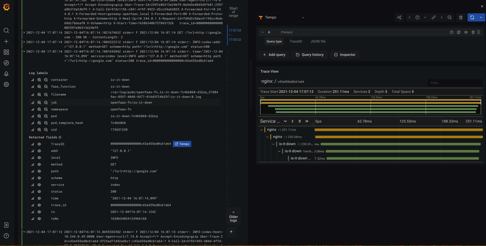
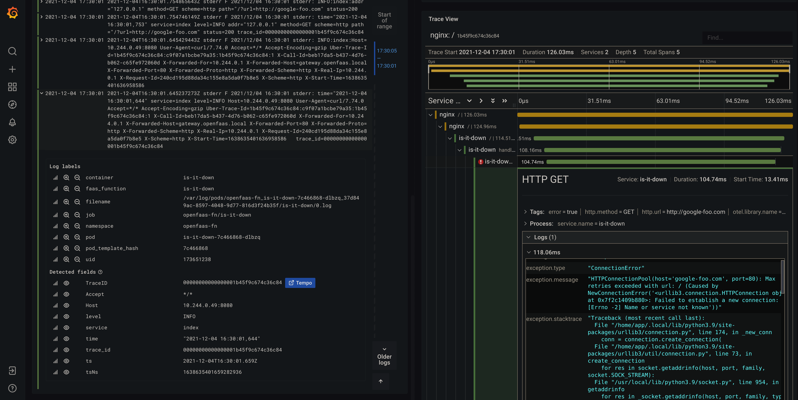

# Tracing and Observability with OpenFaaS

Today we will walk through how to add OpenTracing or OpenTelemetry with Grafana's Tempo.

For this walk-through we will need several CLI toosl:

- `kind`
- `helm`
- `kubectl`
- `faas-cli`

The simplest way to get going is to use `arkade` to install each of these

```sh
arkade get kubectl
arkade get kind
arkade get helm
arkade get faas-cli
```

## Create a cluster

We will use KinD to create our Kubernetes cluster, but, before we start our test cluster, we want to customize our cluster to make it a little easier to work with by exposing port 80 to our localhost. We will use 80 for the ingress to our functions, create the following file as `cluster.yaml`

```yaml
kind: Cluster
apiVersion: kind.x-k8s.io/v1alpha4
nodes:
  - role: control-plane
    kubeadmConfigPatches:
      - |
        kind: InitConfiguration
        nodeRegistration:
          kubeletExtraArgs:
            node-labels: "ingress-ready=true"
    extraPortMappings:
      - containerPort: 30080
        hostPort: 80
        protocol: TCP
      - containerPort: 443
        hostPort: 443
        protocol: TCP
      - containerPort: 31112 # this is the NodePort created by the helm chart
        hostPort: 8080 # this is your port on localhost
        protocol: TCP
```

Now start the cluster using

```sh
kind create cluster --name of-tracing --config=cluster.yaml
```

## Install the required apps

Now we can install the usual components we need

### Tempo and Grafana

First we start with Tempo and Grafana so that the tracing collector service is available for the other services we will install:

```sh
helm repo add grafana https://grafana.github.io/helm-charts
helm repo update
```

Now create the following values file

```yaml
# grafana-values.yaml
env:
  GF_AUTH_ANONYMOUS_ENABLED: true
  GF_AUTH_ANONYMOUS_ORG_ROLE: "Admin"
  GF_AUTH_DISABLE_LOGIN_FORM: true

grafana.ini:
  server:
    domain: monitoring.openfaas.local
    root_url: "%(protocol)s://%(domain)s/grafana"
    serve_from_sub_path: true

datasources:
  datasources.yaml:
    apiVersion: 1

    datasources:
      - name: Tempo
        type: tempo
        access: proxy
        orgId: 1
        url: http://tempo:3100
        isDefault: false
        version: 1
        editable: false
        uid: tempo
      - name: Loki
        type: loki
        access: proxy
        url: http://loki:3100
        isDefault: true
        version: 1
        editable: false
        uid: loki
        jsonData:
          derivedFields:
            - datasourceUid: tempo
              matcherRegex: (?:traceID|trace_id|traceId|traceid=(\w+))
              url: "$${__value.raw}"
              name: TraceID
```

This will do several things for us:

1. configure the Grafana UI to handle the sub-path prefix `/grafana`
2. configure the Tempo data source, this is where our traces will be queried from
3. configure the Loki data source, this is where our logs come from
4. finally, as part of the Loki configuration, we setup the derived field `TraceID`, which allows Loki to parse the trace id from the logs turn it into a link to Tempo.

Now, we can install Tempo and then Grafana

```sh
helm upgrade --install tempo grafana/tempo
helm upgrade --install loki grafana/loki-stack
helm upgrade -f grafana-values.yaml --install grafana grafana/grafana
```

_NOTE_ the Grafana Helm chart does expose Ingress options that we could use, but they currently do not generate a valid Ingress spec to use with the latest `nginx-ingress`, specifically, it is missing an `incressClhelm upgrade -f grafana-values.yaml --install grafana grafana/grafana`. We will handle this later, below.

### Nginx

First we want to enable Nginx to generate incoming tracing spans. We are going to enable this globally in our Nginx installation by using the `config` option

```sh
arkade install ingress-nginx \
    --set controller.config.enable-opentracing='true' \
    --set controller.config.jaeger-collector-host=tempo.default.svc.cluster.local \
    --set controller.hostPort.enabled='true' \
    --set controller.service.type=NodePort \
    --set controller.service.nodePorts.http=30080 \
    --set controller.publishService.enabled='false' \
    --set controller.extraArgs.publish-status-address=localhost \
    --set controller.updateStrategy.rollingUpdate.maxSurge=0 \
    --set controller.updateStrategy.rollingUpdate.maxUnavailable=1 \
    --set controller.config.log-format-upstream='$remote_addr - $remote_user [$time_local] "$request" $status $body_bytes_sent "$http_referer" "$http_user_agent" $request_length $request_time [$proxy_upstream_name] [$proxy_alternative_upstream_name] $upstream_addr $upstream_response_length $upstream_response_time $upstream_status $req_id traceId $opentracing_context_uber_trace_id'
```

Most of these options are specific the fact that we are installing in KinD. The settings that are important to our tracing are these three

```
--set controller.config.enable-opentracing='true' \
--set controller.config.jaeger-collector-host=tempo.default.svc.cluster.local \
--set controller.config.log-format-upstream='$remote_addr - $remote_user [$time_local] "$request" $status $body_bytes_sent "$http_referer" "$http_user_agent" $request_length $request_time [$proxy_upstream_name] [$proxy_alternative_upstream_name] $upstream_addr $upstream_response_length $upstream_response_time $upstream_status $req_id traceId $opentracing_context_uber_trace_id'
```

The first two options enable tracing and send the traces to our Tempo collector. The last option configures the nginx logs to include the trace ID in the logs. In general, I would recommend putting the logs into [`logfmt`](https://brandur.org/logfmt) structure, in short, using`key=value`. This is automatically parsed into fields by Loki and it is much easier to read in it's raw form. Unfortunately, at this time, arkade will not parse `--set` values with an equal sign. Using

```
--set controller.config.log-format-upstream='remote_addr=$remote_addr user=$remote_user ts=$time_local request="$request" status=$status body_bytes=$body_bytes_sent referer="$http_referer" user_agent="$http_user_agent" request_length=$request_length duration=$request_time upstream=$proxy_upstream_name upstream_addr=$upstream_addr upstream_resp_length=$upstream_response_length upstream_duration=$upstream_response_time upstream_status=$upstream_status traceId=$opentracing_context_uber_trace_id'
```

will produce the error `Error: incorrect format for custom flag`

Let's expose our Grafana installation! Create this file as `grafana-ing.yaml`

```yaml
# grafana-ing.yaml
apiVersion: networking.k8s.io/v1
kind: Ingress
metadata:
  name: grafana
  namespace: default
spec:
  ingressClassName: nginx
  rules:
    - host: monitoring.openfaas.local
      http:
        paths:
          - backend:
              service:
                name: grafana
                port:
                  number: 80
            path: /grafana
            pathType: Prefix
```

and apply it to the cluster

```sh
kubectl apply -f grafana-ing.yaml
```

### Verifying the ingress and grafana

Now, let's verify that things are working,

1. edit your `/etc/hosts` file to include
   ```
   127.0.0.1 gateway.openfaas.local
   127.0.0.1 monitoring.openfaas.local
   ```
2. Now open `http://monitoring.openfaas.local`

3. You can explore the logs from nginx, using the Loki query

   ```
   {app_kubernetes_io_name="ingress-nginx"}
   ```

   use this [link](http://monitoring.openfaas.local/grafana/explore?orgId=1&left=%5B%22now-1h%22,%22now%22,%22Loki%22,%7B%22refId%22:%22A%22,%22expr%22:%22%7Bapp_kubernetes_io_name%3D%5C%22ingress-nginx%5C%22%7D%22%7D%5D) to open the query in your Grafana.

### OpenFaaS

Now that we are prepared to monitor our applications, let's install OpenFaaS and and some functions

```sh
arkade install openfaas -a=false --function-pull-policy=IfNotPresent --set ingress.enabled='true'
arkade install openfaas-loki
```

Because we exposed port 8080 when we setup the Cluster and disabled auth when we installed OpenFaaS, we can start using faas-cli right away

```sh
$ faas-cli store deploy nodeinfo

Deployed. 202 Accepted.
URL: http://127.0.0.1:8080/function/nodeinfo
```

But, we can also use the OpenFaaS UI at `http://gateway.openfaas.local`

Let's generate some data by invoking the function

```sh
echo "" | faas-cli invoke nodeinfo
```

In the Grafana UI, you can see the logs using the query `{faas_function="nodeinfo"}`, use [this link](http://monitoring.openfaas.local/grafana/explore?orgId=1&left=%5B%22now-1h%22,%22now%22,%22Loki%22,%7B%22refId%22:%22A%22,%22expr%22:%22%7Bfaas_function%3D%5C%22nodeinfo%5C%22%7D%22%7D%5D).

### Creating traces from your function

Unfortunately, the OpenFaaS gateway does not produces traces like nginx, so right now we only get a very high level overview from our traces. Nginx will show us the timing as well as the request URL and response status code.

Fortunately, all of the request headers are correctly forwarded to our functions, most importantly this includes the tracing headers generated by Nginx. This means we provide more details

This example will use the Python 3 Flask template and OpenTelemetry.

### Setup

1. For this demo I created (and included in this repo) a fork of the python3-flask template. The main addition to the template is this

   ```python
   if hasattr(handler, "initialize"):
       app = handler.initialize(app)
   ```

   which allows us to define an initialization hook inside our handler, so that we can setup the flask tracing middleware.
   If you are writing your own templates, I would recommend including your own logging and tracing configuration in the base template.

2. Initialize the app `is-it-down`

   ```sh
   faas-cli new is-it-down --lang python3-flask
   mv is-it-down.yml stack.yml
   ```

3. Now, set up our python dependencies, add this to the `requirements.txt`

   ```txt
   opentelemetry-api==1.7.1
   opentelemetry-exporter-otlp==1.7.1
   opentelemetry-instrumentation-flask==0.26b1
   opentelemetry-instrumentation-requests==0.26b1
   opentelemetry-sdk==1.7.1
   requests==2.26.0
   ```

4. Now the implementation. The most important (and simplest) part is our handler

   ```py
   def handle(req: Union[str, QueryArgs]):
       """handle a request to the function
       Args:
           req (str): request body
       """
       with tracer.start_as_current_span("handle") as span:
           url = ""
           if isinstance(req, str):
               url = req
           else:
               url = req.get("url", "")

           url = url.strip()

           span.set_attribute("url", url)

           if not valid_uri(url):
               msg = f'invalid or empty url: "{url}"'
               span.set_attribute("err.msg", msg)
               span.set_status(StatusCode.ERROR)
               return msg, 409

           try:
               r = requests.get(url)
           except requests.exceptions.ConnectionError:
               span.set_attribute("response", "down")
               return "down"

           if r.status_code > 399:
               span.set_attribute("response", "down")
               return "down"

           span.set_attribute("response", "up")
           return "up"
   ```

   To add tracing to our function, we just need to use the `start_as_current_span` context handler:

   ```py
   with tracer.start_as_current_span("handle") as span:
   ```

   creates a new tracing span, named `handle`. Because we are using the context handler, it will automatically close the span when we leave the `with` block.

   This is a pattern that will be familiar the from Python docs for the `open` method used to open (and then automatically close) files, [see here](https://docs.python.org/3/tutorial/inputoutput.html#reading-and-writing-files).

   Fortunately, if tracing is disable or otherwise non-configured OpenTelemetry has a default no-op tracer. Meaning we can safely add this code to our function without worrying about breaking anything.

   Of course we _do_ want to generate real traces but to do that we need to configure a tracing provider. For our function, that looks like this. Many of these methods can accept various options, but in many cases the OpenTelemetry objects have defaults or can read from environment varialbes, so I have opted to allow the OpenTelemetry SDK to automatically configure itself from the environment. See [the OpenTelemetry docs](https://opentelemetry-python.readthedocs.io/en/latest/sdk/environment_variables.html#opentelemetry-sdk-environment-variables) for all of the possible options.

   ```py
   resource = Resource(attributes={SERVICE_NAME: NAME})
   provider = TracerProvider(resource=resource)

   if os.getenv("TRACING", "false").lower() in TRUTHY:
       # configure via the OTEL_EXPORTER_OTLP_* env variables
       # see https://opentelemetry-python.readthedocs.io/en/latest/sdk/environment_variables.html#opentelemetry-sdk-environment-variables
       exporter = OTLPSpanExporter()
       provider.add_span_processor(BatchSpanProcessor(exporter))

   trace.set_tracer_provider(provider)
   tracer = trace.get_tracer(__name__)


   def initialize(app: Flask) -> Flask:
       FlaskInstrumentor().instrument_app(app)
       RequestsInstrumentor().instrument()

       app.logger.setLevel(LOG_LEVEL)

       default_handler.setFormatter(SpanFormatter(LOG_FMT))

       # hook to log requests
       def log_request(response):
           app.logger.info(
               'addr="%s" method=%s scheme=%s path="%s" status=%s',
               request.remote_addr,
               request.method,
               request.scheme,
               request.full_path,
               response.status_code,
           )
           return response

       app.after_request(log_request)

       return app
   ```

   see the full source code in the [repo](https://github.com/LucasRoesler/openfaas-tracing-walkthrough)

5. Try the function. If you are running this locally or with your own custom function, then we need to build and load the function into our cluster

   ```sh
   faas-cli build
   kind --name of-tracing load docker-image ghcr.io/lucasroesler/is-it-down:latest
   ```

   Now we can deploy it

   ```sh
   faas-cli deploy
   ```

   To invoke we can use

   ```sh
   $ echo "http://google.com" | faas-cli invoke is-it-down
   up
   ```

Now, you can go to the Loki logs to find one of the function traces [{faas_function="is-it-down"}](http://monitoring.openfaas.local/grafana/explore?orgId=1&left=%5B%22now-15m%22,%22now%22,%22Loki%22,%7B%22refId%22:%22A%22,%22expr%22:%22%7Bfaas_function%3D%5C%22is-it-down%5C%22%7D%22%7D%5D), the trace id will be in the log. Using this, we can jump to the corresponding trace to see the timing.



A failed/errored request will look like this



## Wrapping up

You will notice that we didn't need to do any configuration to the OpenFaaS components. The main reason for this, is that tracing is propagated via HTTP headers, which are safely preserved during function requests (even during async function calls). To use tracing, you only need to ensure that your function template is tracing aware and then configure the env variables.

To bring this to the default templates, we need to develop a pattern similar to my `initialize(app)` hook. For some languages, like Python, this is pretty straightforward. Let us know if you have suggestions for the other language templates.
